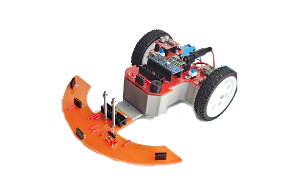

# Otto diy Robot - MindPlus Extension (offline mode)

Το έργο αυτό είναι είναι extension για την εφαρμογή [Mind+](https://mindplus.cc/) το οποίο "μαζεύει" σε ένα σετ εντολών όλες τις λειτουργίες του κιτ που εναλλακτικά θα απαιτούσαν πολλά πρόσθετα για να λειτουργήσουν. 

---------------------------------------------------------

## Άλλα διαθέσιμα Mind+ πρόσθετα για κιτ Ρομποτικής Πρωτοβάθμιας

[Mind+ offline extension για Polytech S1](https://gitlab.com/ale3andro/mindplus_ext_s1)

[Mind+ offline extension για Polytech R2](https://gitlab.com/ale3andro/mindplus_ext_r2)

[Mind+ offline extension για Microbit GigoRobot](https://github.com/ale3andro/mindplus_ext_gigorobot)

---------------------------------------------------------

## Τι είναι το Robot Otto

Ο Otto DIY είναι ένα ρομπότ το οποίο εκτυπώνεται σε 3d εκτυπωτή και στη συνέχεια συναρμολογείται. Εκτός από τα πλαστικά μέρη (που εκτυπώνονται), για τη συναρμολόγηση του ρομπότ χρειάζονται:

* 1 x Arduino Nano

* 4 x σέρβο κινητήρες (μικρούς τύπου SG90)

* 1 x buzzer και 

* 1 x αισθητήρας απόστασης (τύπου HC-SR04)

Περισσότερα [εδώ](https://www.ottodiy.com/)

O Otto προγραμματίζεται απευθείας από το Arduino IDE αλλά και από την εφαρμογή Otto Blockly, η οποία διατίθεται στην παραπάνω ιστοσελίδα (δωρεάν). Η εφαρμογή για Linux, έχει μείνει μερικές εκδόσεις πίσω σε σχέση με την εφαρμογή για Windows. 

Για τον προγραμματισμό του ρομπότ, έχει αναπτυχθεί η βιβλιοθήκη [OttoDIYLib](https://github.com/OttoDIY/OttoDIYLib).

Έχω φτιάξει αυτό το πρόσθετο για Mind+, το οποίο κάνει import την παραπάνω βιβλιοθήκη και επιτρέπει τον προγραμματισμό του ρομπότ μέσα από την εφαρμογή [Mind+](https://mindplus.cc/)

## Otto robot pinout

| Item | pin |
|---|---|
| LeftLeg | D6 |
| RightLeg |  D5
| LeftFoot | D10 
| RightFoot | D9 
| Buzzer | A3
| Distance Sensor : Trigger |  D2 |
| Distance Sensor : Echo |  D4 |

---------------------------------------------------------

## Άλλα διαθέσιμα Mind+ πρόσθετα για κιτ Ρομποτικής Πρωτοβάθμιας

[Mind+ offline extension για Polytech S1](https://gitlab.com/ale3andro/mindplus_ext_s1)

[Mind+ offline extension για Polytech R2](https://gitlab.com/ale3andro/mindplus_ext_r2)

[Mind+ offline extension για Microbit GigoRobot](https://github.com/ale3andro/mindplus_ext_gigorobot)

---------------------------------------------------------

## License

MIT

